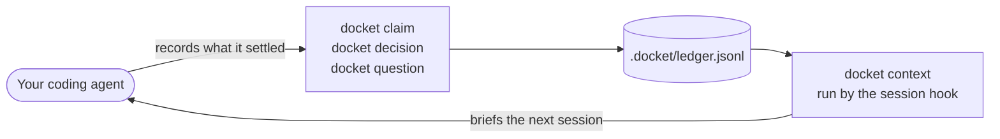

# docket

**A decision ledger for coding agents.**

Keep track of what was decided, why, and what is still open. Docket gives agents
relevant context when a conversation resumes or gets compacted.

Records live in an append-only ledger. When a choice changes, the old reasoning
stays available.



## Install

Requires **Python 3.11+** and Git. Go 1.26+ is needed only when building from a
source checkout.

Expand the prompt below, copy it, and paste it into your agent:

<details>

<summary>Copy setup prompt</summary>

```text
Set up Docket for the agent I am using in this project. Install the
terminal command, native graph viewer, and integration for this agent.

1. Identify the current agent, operating system, and architecture.
   Check for Python 3.11+ and Git. The downloaded installer does not
   require Go. Building from a source checkout requires Go 1.26+.
   If a requirement is missing, tell me what is needed.

2. Check whether Docket is already installed. Reuse its existing paths
   and preserve my configuration and ledger. Configure only the agent
   I am using. Ask which agent to configure if you cannot identify it.

3. Download the launcher below into a temporary directory outside any
   Docket source checkout, then read it before running it:
   https://raw.githubusercontent.com/NovusEdge/docket/main/installer/install.py

   Let the installer create the permanent checkout. Do not install
   from a temporary clone or leave installed paths pointing into a
   temporary directory.

4. Use the launcher with --harness and the value for my agent:
   Claude Code: claude-code
   Codex: codex
   Gemini CLI: gemini
   Cursor: cursor
   GitHub Copilot CLI: copilot
   OpenCode: opencode

   Run it with Python 3.11+ from my project directory. On Linux or
   macOS, use python3; on Windows, use a suitable Python command such
   as py -3. Use the launcher's absolute path between shell calls.

5. Run with --dry-run first. Review the checkout location, command
   location, PATH changes, and agent configuration. Preserve custom
   paths with --dir and --prefix where needed. The default integration
   is user-level. Apply the reviewed setup by running the same command
   without --dry-run, following the environment's approval rules.

6. Check that the agent can discover its integration. For OpenCode,
   check plugin placement against the installed OpenCode version and
   keep one active copy. Preserve unrelated settings and report any
   manual step that remains.

7. From my project, run docket --version, docket where, docket check,
   and docket context. Use the installed command's full path if PATH
   has not refreshed. Confirm that the native viewer binary exists.
   An empty project may have no ledger or context yet. Do not create
   sample records or run docket init unless I ask for a shared ledger.

8. Tell me where Docket was installed, which integration was configured,
   and which checks passed. Explain anything that still needs attention.
   Remind me to start a new agent session in this project and ask it
   to read Docket context. Remove only the temporary launcher files
   created for this setup.
```

</details>

Or [choose your agent and install it yourself](docs/installation.md#configure-an-agent-harness).
Claude Code and Codex have plugin install commands. The guided installer prepares
the terminal command, graph viewer, and selected agent integrations.

[Requirements and setup](docs/installation.md) ·
[Your first decision](docs/quickstart.md) ·
[Read the docs](https://novusedge0.gitbook.io/docket-docs/)

## Record claims, choices, and questions

| Record | What it captures | Example ID |
|---|---|---|
| **Claim** | A proposition to assess | `c1` |
| **Decision** | A choice and its reasoning | `d2` |
| **Question** | Something still unresolved | `q3` |

Record a claim:

```sh
docket claim "The service already runs Postgres in production"
```

Make a decision:

```sh
docket decision "The service uses Postgres." \
  --choice "Postgres" \
  --rationale "Use the database we already operate"
```

Leave a question for later:

```sh
docket question "Which async driver should we use?"
```

Claims start as `unassessed`. Accepting a claim records a workflow assessment.
Verification of the claim and its evidence happens outside Docket.
You can also link records to evidence, prerequisites, answers, and earlier
choices they replace. See [Recording decisions](docs/recording.md) for a
walkthrough.

## Browse the ledger

```sh
docket graph
```

The installed native viewer gives you a selectable tree, search, and a detail
pane. Piped output stays plain text.

| Command | Use it to |
|---|---|
| `docket list` | List records |
| `docket show d2` | Inspect a record by its ID |
| `docket list --json` | Read structured records |
| `docket where` | Find the active ledger |
| `docket init` | Copy the ledger into `.docket/` for sharing in Git |

## Give an agent the context it needs

Configured session hooks load a briefing automatically. For a specific task,
select relevant records by topic and file:

```sh
docket context --query "database" --file src/db.py --max-chars 4000
```

Docket measures budget in **characters** instead of tokens. It keeps whole
records, reports what was omitted, and includes a command to retrieve more.

## Learn more

- [Your first decision](docs/quickstart.md): create a project ledger and try it.
- [Recording decisions](docs/recording.md): save choices, answer questions, and change your mind.
- [Reading your ledger](docs/reading.md): find records and browse their connections.
- [Working with your agent](docs/agents.md): use Docket during a conversation.
- [Sharing and maintenance](docs/maintenance.md): share records and resolve ledger problems.
- [Technical reference](docs/ledger.md): states, relationships, evidence, and context selection.
- [Changelog](CHANGELOG.md): what changed in each release.

**Upgrading from before 0.8?** The ledger format and commands changed.
Follow the [migration guide](docs/ledger.md#migrating-a-schema-1-ledger)
before using an existing ledger.
