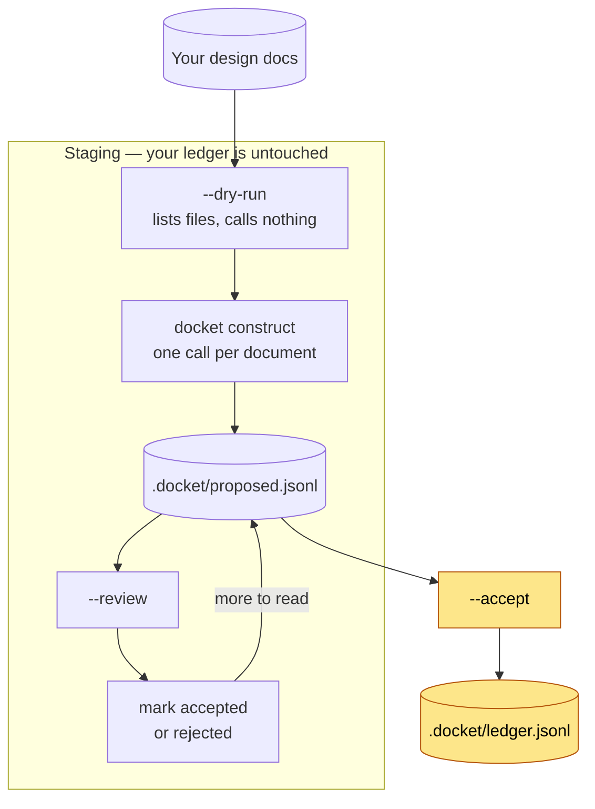

# Constructing on existing projects

`docket construct` proposes ledger records from existing design notes. Use it
to bring earlier decisions into Docket when you add it to an established
project.


Construct stages proposals for review. Read them and mark the ones you want
to keep, then run `--accept` to add them to the ledger.




## Before you start

Construct is the only command that needs a dependency and an API key. Every
other command, and the session hook your agent runs, work without either.

Set one key. An OpenRouter key reaches every provider through one endpoint:

```sh
export OPENROUTER_API_KEY=...
```

A `GEMINI_API_KEY`, `OPENAI_API_KEY`, or `ANTHROPIC_API_KEY` works instead and
calls that provider directly. The first one set wins, in that order;
`DOCKET_CONSTRUCT_PROVIDER` names one explicitly.

Install the SDK your key needs:

```sh
docket construct --install-sdk openrouter
```

This creates a virtualenv under the global store and installs the provider SDK. It
uses `uv`, so install [uv](https://docs.astral.sh/uv/) first if you do not have
it. The installer offers the same step during setup, and
`--construct <provider>` selects it unattended.

Every provider except Anthropic is reached through the `openai` package.
Anthropic needs its own, because its OpenAI-compatible layer ignores
`response_format`, which is how construct asks for the schema.

A package already installed in your environment takes precedence over the
virtualenv. For example, construct uses an existing `openai` installation
when available.

See [Environment variables](environment.md) for the model and endpoint
overrides.

## See what it would read


Run this first to list the documents without making API calls. No key is needed.


```sh
docket construct --dry-run context/decisions context/specs
```

Name directories or single files. Construct reads `*.md` under a directory, at
any depth.

## Stage the proposals

```sh
docket construct context/decisions context/specs
```

Construct makes one extraction call per document and reports matched anchors,
rejected proposals, and proposed relationships:

```
read 42 documents
context/decisions/2026-06-18-coherence-layer.md: 15/15 anchors matched
context/specs/auth.md: dropped a record, its anchor quotes no line in the document
link: 2 batches
link: kept 18 edges
link: asked 3 questions about contradictions
docket: staged 412 proposals in .docket/proposed.jsonl
```

Every proposal carries an **anchor**: one line copied from the source document.
A proposal is dropped if its anchor matches no line in the source document.

The **anchor match rate** tells you whether the run is trustworthy. A document
reporting 15/15 was read closely. One reporting 4/12 was paraphrased, and every
record from it needs your eye before you accept it.

A second pass reads the proposal set and proposes relationships: support,
replacement, and disagreement. When it cannot resolve a disagreement, it
proposes a question naming both records rather than replacing either one.

## Read them

```sh
docket construct --review
```

Proposals group by source document, strongest first:

```
# scope resolves: 221/396
# staged: 412

## context/decisions/2026-06-18-coherence-layer.md
  decision (high)
    How is audit-repair checking arranged?
    choice: Tiered by epistemic layer
    scope: src/coherence/**
    anchor: **Decision:** Option B - tiered checking by layer.
    key: 5c644f951a7b
```

Find the anchor in the source document and check whether the proposed record
accurately represents it.

`scope resolves` is the number to watch. A record whose scope matches no file in
the repository can never reach a briefing, and those sort to the bottom of each
group marked `[unresolved scope]`. A run resolving most of its scoped records
points at live code. A run resolving few of them describes code that is gone,
and the answer is to narrow what you feed it rather than to accept the result.

Construct keeps records with stale paths because they may still explain
earlier changes, such as a rename.

## Accept what is right

Mark a proposal by changing its `state` to `accepted` in
`.docket/proposed.jsonl`. Leave the rest alone, or set `rejected` for the ones
you never want to see again.

```sh
docket construct --accept
```


This step writes to your ledger. It allocates record IDs, updates relationships
to use those IDs, and appends records with the same numbering and locking rules
as manual recording.


Take one document at a time:

```sh
docket construct --accept --source context/decisions/auth.md
```

Each proposal retains its review state, so you can stop and continue later.
Review large sets over several sessions if needed.

Accepted records name their source document in the rationale and record
`docket-construct` as the author, so a later reader can tell a constructed record
from one a person wrote at the time.

A record is skipped if you have not accepted a record it cites as support.
This preserves its declared grounds.

## Running it again

Construct identifies each proposal by its source path and anchor. A proposal
you already accepted stays accepted on a later run, even if the model words
it differently.

Editing the source line changes that key and returns the record to review
because its supporting text has changed.

## What it does not do well

Construct finds few supersessions. It groups records into batches that keep
each document whole. An earlier decision and its replacement may be in separate
documents and end up in different batches. Record missed supersessions by hand
as you find them.

Construct does not read commit messages by default. Their usefulness as input
has not been measured.

## Costs

One call per document, plus one per batch of about 120 proposals. Reading 400
documents of a few thousand words each costs well under a dollar on a fast
model. Cost is not the reason to narrow the input set. A low scope resolution
rate is.
