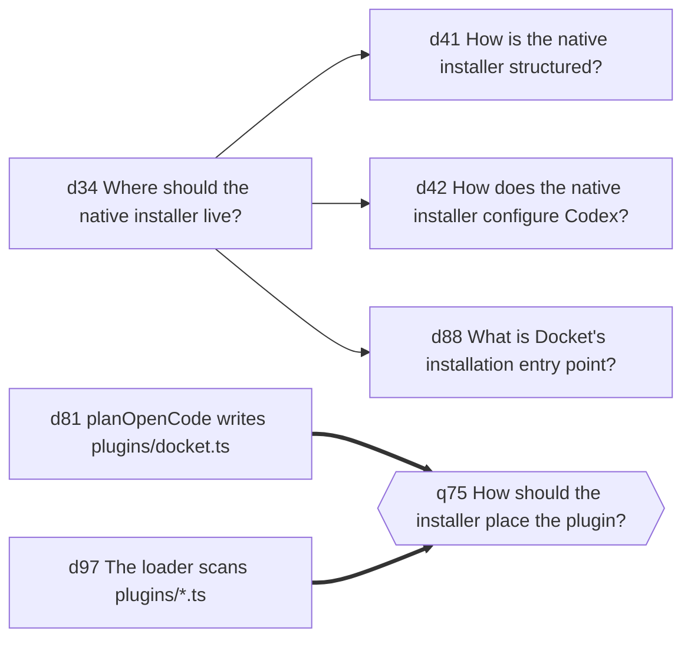

# Reading your ledger

Use `list` to find a record, `show` to read it in full, and `graph` to browse
its connections. Use `context` when you want a briefing for a task.

Examples with IDs use the ledger from [Recording decisions](recording.md).
Substitute your own record IDs when using these commands in another project.

## Find a record

```sh
docket list
```

The list shows each current record's ID, state, and text. A decision also shows
its choice. A `<- c1` marker points to a supporting record.

You can narrow the list by what you need:

| To find… | Run |
|---|---|
| Open questions | `docket list --kind question --state open` |
| Decisions | `docket list --kind decision` |
| Records mentioning Postgres | `docket list --find postgres` |
| A compact list | `docket list --oneline` |
| Earlier records as well as current ones | `docket list --superseded` |

Use `docket list --json` when you want to read the result from a script.

## Read one record

```sh
docket show d2
```

This shows the choice, its rationale, and any links to other records. Use
`docket show d2 --json` for every field, including scope and evidence.

Replaced records remain readable by ID. To see a record as it stood earlier in
the ledger, add `--at`:

```sh
docket show q3 --at d4
```

In the recording guide's example, this shows the question when `d4` answered
it. Later changes do not affect that view.

## Browse connected records

```sh
docket graph
```

When the native viewer is installed, this opens a tree and a detail pane in your
terminal. Select a record in the tree to read its details.

<!-- TODO(screenshot): the graph viewer with a decision selected, its support
     and depends_on edges visible in the tree, and the detail pane filled. The
     key table below names the controls but shows nothing of the two-pane
     layout. Use a ledger with enough records that the tree has real depth. -->


| Key | Action |
|---|---|
| Arrow keys or `j` and `k` | Move through records |
| `gg` and `G` | Jump to the first or last record |
| `space` or `enter` | Collapse or expand a branch |
| `tab` | Switch between the tree and details |
| `s` | Cycle the sort field: ledger, id, timestamp, kind, state |
| `r` | Reverse the sort direction |
| `/` | Search |
| `q` | Quit |

See the [viewer reference](installer-reference.md#browse-the-decision-graph)
for detail scrolling, search controls, and output options.

If the viewer is missing, Docket prints a text graph and setup guidance. Piped
output also stays as text:

```sh
docket graph | less -R
```

Use `--no-interactive` to request text output directly.

## Export the graph

`docket graph --format` prints the relation graph as text, in mermaid or
graphviz DOT.

| Format | Viewer | Install |
|---|---|---|
| `mermaid` | GitHub, GitLab, GitBook, [mermaid.live](https://mermaid.live) | None |
| `dot` | `dot -Tsvg`, and any graphviz front end | graphviz |

Mermaid pastes into a fenced `mermaid` block and renders where this project's
docs already live. DOT lays out a large graph better and gives real SVG, PDF
and PNG, and the reader needs graphviz for any of it.

```sh
docket graph --format mermaid --find installer
docket graph --format mermaid --superseded --detail 0 > graph.mmd
docket graph --format dot --find installer | dot -Tsvg -o installer.svg
```

### A worked example

`docket graph --format mermaid --find installer` on this project's own ledger
prints seven nodes and five edges:



Read it as: d34 is the premise d41, d42 and d88 rest on, and two decisions
answer q75. Pipe the same selection through `dot -Tsvg` for a file you can
attach to a ticket.

The `--kind`, `--state` and `--find` filters the viewer takes narrow the
export, and a filtered graph is the readable one. This project's whole ledger
draws 72 nodes and 57 edges; `--find installer` draws 7 and 5.

| Option | Effect |
|---|---|
| `--superseded` | Include retired records and the retire edges. Roughly doubles the edges. |
| `--detail N` | Characters of record text per node, default 40. Use `0` for IDs alone. |
| `--direction` | `LR` by default, or `TD`, `RL`, `BT`. |

Each relation reads apart without a legend. In mermaid: `-->` supports, `-.->`
depends on, `==>` answers, and a labelled arrow for retires. In DOT the same
four separate on line style and arrowhead, with no colour, so a printed graph
stays readable. A decision draws as a rectangle, a claim as a stadium or
ellipse, a question as a hexagon. Retired records are greyed.

A record with no relation is left out, because a node alone on the canvas says
less than a list line does. A record with more than one support set gets a
join node per set, so the diagram does not draw it as needing every premise
when it needs one complete set.

DOT wraps a label over several lines. A hexagon or an ellipse grows sideways
to hold its text, and one long line turns a question node into a lozenge wider
than the rest of the graph.

## Read the briefing for a task

```sh
docket context --query "billing database" --file billing/db.py
```

A **briefing** is a selection of records for you or your agent to read before
working. Records that match the task receive more space. Other records may
appear in a short index, and the footer tells you how much was included.

The briefing is a starting point. Use `docket show ID --json` to retrieve a
record mentioned in the index, or `docket list` to browse beyond it.

With no query or file arguments, `docket context` uses changed and untracked
files in your Git checkout as a guide. In a clean checkout, it uses the files
from the latest commit. Pass `--no-auto-scope` to turn this off.

## Adjust what you see

To set a firm size limit:

```sh
docket context --query "billing" --max-chars 4000
```

The limit is measured in characters. The default minimum is 512. Without an
explicit limit, Docket aims for 8,000 characters and can use more space for
matching records.

To ask for the whole ledger within a budget:

```sh
docket context --all --max-chars 12000
```

To see changes since a record:

```sh
docket context --since d4
```

The [ledger reference](ledger.md#bounded-context) covers selection rules,
budgets, and coverage in depth. For help with missing context, see
[Working with your agent](agents.md#when-a-decision-is-missing).
