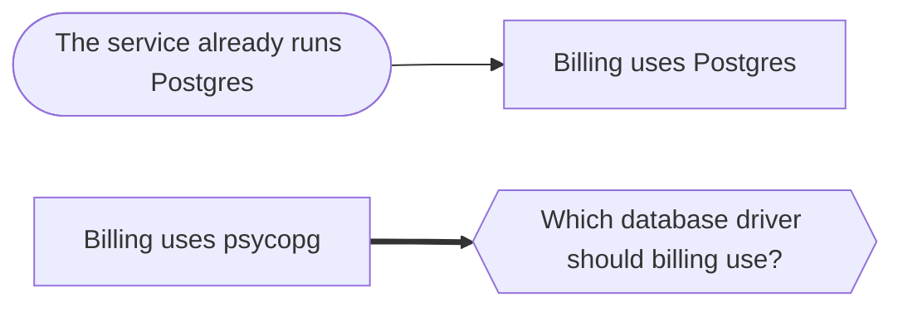

# Reading your ledger

Use `list` to find a record, `show` to read it in full, and `graph` to browse
its connections. Use `context` when you want a briefing for a task.

Examples with IDs use the ledger from [Recording decisions](recording.md).
Substitute your own record IDs when using these commands in another project.

## Find a record

```sh
docket list
```

The list shows each current record's ID, state, and text. A decision also shows
its choice. A `<- c1` marker points to a supporting record.

You can narrow the list by what you need:

| To find… | Run |
|---|---|
| Open questions | `docket list --kind question --state open` |
| Decisions | `docket list --kind decision` |
| Records mentioning Postgres | `docket list --find postgres` |
| A compact list | `docket list --oneline` |
| Earlier records as well as current ones | `docket list --superseded` |

Use `docket list --json` when you want to read the result from a script.

## Read one record

```sh
docket show d2
```

This shows the choice, its rationale, and any links to other records. Use
`docket show d2 --json` for every field, including scope and evidence.

Replaced records remain readable by ID. To see a record as it stood earlier in
the ledger, add `--at`:

```sh
docket show q3 --at d4
```

In the recording guide's example, this shows the question when `d4` answered
it. Later changes do not affect that view.

## Browse connected records

```sh
docket graph
```

When the native viewer is installed, this opens a tree and a detail pane in your
terminal. Select a record in the tree to read its details.

<!-- TODO(screenshot): the graph viewer with a decision selected, its support
     and depends_on edges visible in the tree, and the detail pane filled. The
     key table below names the controls but shows nothing of the two-pane
     layout. Use a ledger with enough records that the tree has real depth. -->


| Key | Action |
|---|---|
| Arrow keys or `j` and `k` | Move through records |
| `gg` and `G` | Jump to the first or last record |
| `space` or `enter` | Collapse or expand a branch |
| `tab` | Switch between the tree and details |
| `s` | Cycle the sort field: ledger, id, timestamp, kind, state |
| `r` | Reverse the sort direction |
| `/` | Search |
| `w` | Open the graph in a browser |
| `q` | Quit |

See the [viewer reference](installer-reference.md#browse-the-decision-graph)
for detail scrolling, search controls, and output options.

If the viewer is missing, Docket prints a text graph and setup guidance. Piped
output also stays as text:

```sh
docket graph | less -R
```

Use `--no-interactive` to request text output directly.

## Browse in a web page

`docket graph --web` serves the relation graph to your browser. It prints the URL as its first line and opens it. The default port is 7347, or a free one if that is taken; `--port N` picks another. In the terminal viewer, `w` opens the web view for the current filter. Press it again to restart the view with a changed filter. Quitting the viewer stops it. `w` passes the viewer's filter text as `--where`; flags the viewer was started with (`--kind`, `--state`, `--find`) are not carried over.

```sh
docket graph --web --where scope:docket/cli/
```

The page polls the ledger every 2 seconds. When the ledger changes, the graph redraws within a couple of seconds and keeps your zoom and the record you have open.

Press `/` to search. The kind and retired chips dim nodes without laying the graph out again. Selecting a node slides in a drawer with the full record, and the references in it are clickable. A toggle switches between the light and dark theme.

The download buttons save what is on screen as SVG or PNG.

The server listens on 127.0.0.1 only and refuses requests for any other host name. It runs until you press Ctrl-C.

## Export the graph

`docket export` writes the relation graph in three formats, selected with `--format`. Without it, export prints mermaid.

| Format | Viewer | Install | Output |
|---|---|---|---|
| `mermaid` | GitHub, GitLab, GitBook, [mermaid.live](https://mermaid.live) | None | stdout |
| `dot` | `dot -Tsvg`, and any graphviz front end | graphviz | stdout |
| `csv` | Gephi, or anything reading a node and edge table | Gephi | two files |

Paste Mermaid output into a fenced `mermaid` block in GitHub, GitLab, or
GitBook. Use DOT with Graphviz to lay out larger graphs and generate SVG, PDF,
or PNG files. Import CSV into an analysis tool to measure centrality, find
clusters, or filter by node attributes.

```sh
docket export --find installer
docket export --superseded --detail 0 > graph.mmd
docket export --format dot --find installer | dot -Tsvg -o installer.svg
docket export --format csv --out gephi/ --superseded
```

`--kind`, `--state`, `--find`, `--where`, `--superseded` and `--detail` narrow all three.
`--direction` applies to mermaid and DOT.

### Gephi

`--format csv` writes two files, because Gephi imports a node table and an
edge table separately. Name the directory with `--out`.

```sh
docket export --format csv --out gephi/
```

In Gephi, use **File > Import spreadsheet** to import `nodes.csv` as a node
table, then `edges.csv` as an edge table into the same workspace.

`nodes.csv` carries `Id` and `Label` for Gephi itself, then `kind`, `state`,
`retired`, `scope`, the full `text` and `support` as node attributes. Partition by `kind`
to colour claims, decisions and questions apart, or filter on `retired` to
drop the retired records after importing them.

`edges.csv` carries `Source`, `Target`, `Type` and a `Label` naming the
relation: `supports`, `depends_on`, `answers` or `supersedes`. Every edge is
directed. Filter on `Label` to see one relation at a time.

A record with more than one support set gets a `set` join node for each set,
as in the other formats. This preserves the distinction between alternative
sets and premises required together. These nodes have `kind` set to `set`,
so a partition can distinguish them from records.

### A worked example

For the example ledger in [Recording decisions](recording.md), a graph can
show the database choice's supporting claim and the driver choice's answer
to an open question. With record labels simplified, those relationships are:


```mermaid
flowchart LR
  existing_db(["The service already runs Postgres"])
  database["Billing uses Postgres"]
  driver_question{{"Which database driver should billing use?"}}
  driver["Billing uses psycopg"]
  existing_db --> database
  driver ==> driver_question
```

The claim supports the database decision, and the driver decision answers the
question. Pipe a DOT export through `dot -Tsvg` for a file you can attach to
a ticket.

Use the viewer's `--kind`, `--state`, and `--find` filters to narrow an export
to the records relevant to your task.

| Option | Effect |
|---|---|
| `--superseded` | Include retired records and the edges that retire them. |
| `--detail N` | Characters of record text per node, default 40. Use `0` for IDs alone. |
| `--direction` | `LR` by default, or `TD`, `RL`, `BT`. |

Mermaid uses `-->` for support, `-.->` for prerequisites, `==>` for answers,
and a labelled arrow for retirement. DOT distinguishes the same four relations
by line style and arrowhead, without relying on colour. Decisions appear as
rectangles, claims as stadiums or ellipses, and questions as hexagons. Retired
records are greyed.

A record with no relation is left out. Use `docket list` to include these
records. A record with more than one support set gets a join node per set,
showing that it needs one complete set rather than every premise.

DOT wraps labels across several lines to keep long text from stretching
hexagonal or elliptical nodes across the graph.

Mermaid and DOT draw a flagged record with a dashed border and an unsupported one with a dotted border, so the status survives a black and white print. In Gephi, partition by the `support` column in `nodes.csv` to colour them apart.

## Records that need review

When a record's grounds change, Docket marks the records that cite it. A claim or decision is `flagged` when a ground was revised, or is unassessed, disputed or circular, and nobody has reviewed it since. It is `unsupported` when no complete set of its grounds survives, for example after a reversal.

To find them:

```sh
docket list --where is:flagged
docket list --where is:unsupported
```

`show` says what changed. Here the claim behind `d2` was revised by `c3`:

```text
d2  decision  adopted  Billing uses Postgres.
  Choice: Postgres
  Rationale: Reuse the existing database
  Because: c1 (The service already runs Postgres.)
  Review owed: c1 -> c3 (revise)
```

If the decision still holds against `c3`, record that you checked:

```sh
docket review d2 --note "Still fine on the managed host"
```

The flag clears until the same chain is revised again. If the decision no longer holds, supersede it instead. An unsupported record shows `Lost grounds:` in place of `Review owed:`. `docket review` does not clear it, so supersede it with a record that has grounds that hold.

A flag can also come from a ground that is itself flagged. `docket review` refuses such a record and names the ground to review first. The briefing ends with a count of records that owe review, and the text `graph` marks them `? review` or `! lost`. The [commands reference](commands.md#reading) lists the derived fields.

## Read the briefing for a task

```sh
docket context --query "billing database" --file billing/db.py
```

A **briefing** is a selection of records for you or your agent to read before
working. Records that match the task receive more space. Other records may
appear in a short index, and the footer tells you how much was included.

The briefing is a starting point. Use `docket show ID --json` to retrieve a
record mentioned in the index, or `docket list` to browse beyond it.

With no query or file arguments, `docket context` uses changed and untracked
files in your Git checkout as a guide. In a clean checkout, it uses the files
from the latest commit. Pass `--no-auto-scope` to turn this off.

## Adjust what you see

To set a firm size limit:

```sh
docket context --query "billing" --max-chars 4000
```

The limit is measured in characters. The default minimum is 512. Without an
explicit limit, Docket aims for 8,000 characters and can use more space for
matching records.

To ask for the whole ledger within a budget:

```sh
docket context --all --max-chars 12000
```

To see changes since a record:

```sh
docket context --since d4
```

The [ledger reference](ledger.md#bounded-context) covers selection rules,
budgets, and coverage in depth. For help with missing context, see
[Working with your agent](agents.md#when-a-decision-is-missing).
